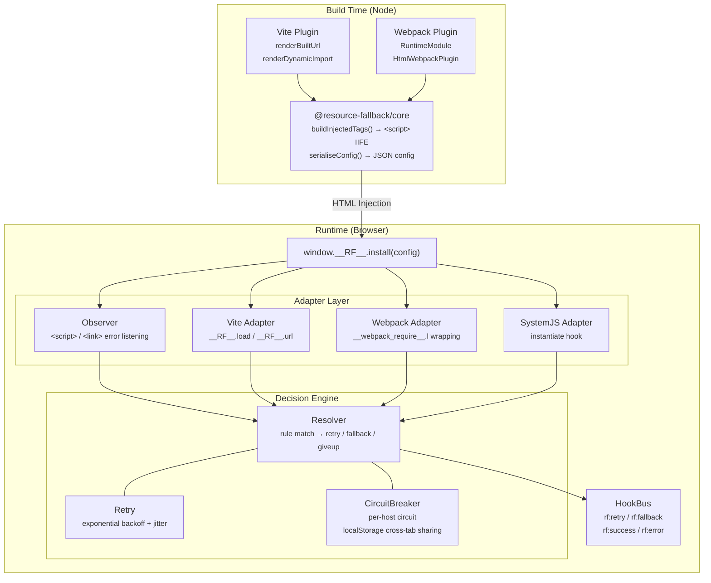
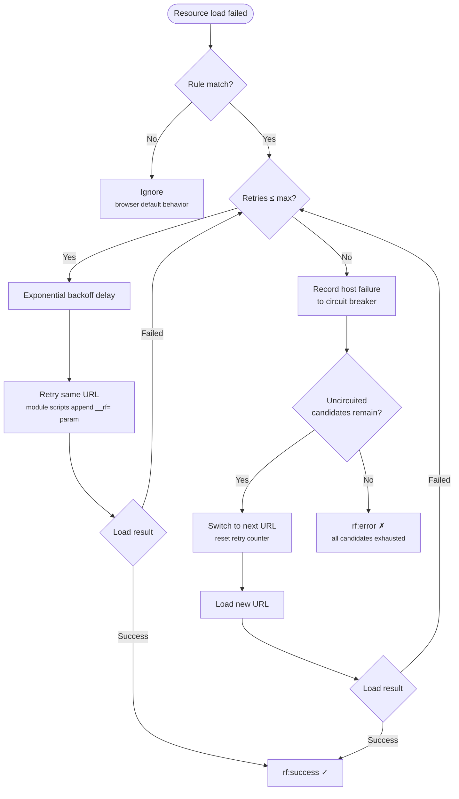

# resource-fallback

> **[中文](README.md)** | English

Zero-mental-overhead frontend resource fallback solution. Provides runtime **retry → multi-CDN fallback → origin** capabilities for Webpack and Vite build outputs (sync / async JS, CSS) — no changes to business code required.

## Core Features

- **Zero business code changes** — just register the plugin in your build config. `React.lazy`, Vue `defineAsyncComponent`, Vue Router lazy-loaded routes, and other async patterns work out of the box
- **Full resource coverage** — intercepts the entire loading pipeline for both sync and async JS & CSS (Webpack chunk loader / Vite dynamic import / `<script>` & `<link>` error events)
- **Smart retry** — exponential backoff + random jitter to avoid thundering herd; configurable max retries per URL
- **Per-host circuit breaker** — automatically skips hosts after consecutive failures reach a threshold, recovers after cooldown; cross-tab state sharing via `localStorage` + `storage` events
- **Triple kill switch** — `window.__RF_DISABLE__` global variable / `?__rf=off` query param / `__rf_disable=1` cookie; emergency shutoff without a new release
- **CSP friendly** — supports `nonce` attribute and `externalRuntime` external script mode
- **SRI compatible** — three strategies: strip / keep / strict
- **Automatic preconnect** — injects `<link rel="preconnect">` for each fallback domain, reducing DNS + TLS latency
- **Event system** — DOM CustomEvent (`rf:retry` / `rf:fallback` / `rf:success` / `rf:error`) + JS function hooks for easy monitoring integration
- **Module cache busting** — automatically adds `__rf=` parameter to ES Module scripts and Vite dynamic imports to bypass browser module cache
- **SystemJS support** — provides fallback for `@vitejs/plugin-legacy` and other SystemJS scenarios via `System.constructor.prototype.instantiate` hook

## Architecture Overview



### Fallback Flow



## Packages

| Package | Description | Version |
| --- | --- | --- |
| [`@resource-fallback/core`](packages/core) | Browser IIFE runtime + Node utility functions | `0.0.1` |
| [`@resource-fallback/vite-plugin`](packages/vite-plugin) | Vite 4+ plugin | `0.0.1` |
| [`@resource-fallback/webpack-plugin`](packages/webpack-plugin) | Webpack 5+ plugin | `0.0.1` |

## Quick Start

### Vite

```ts
// vite.config.ts
import { defineConfig } from 'vite';
import resourceFallback from '@resource-fallback/vite-plugin';

export default defineConfig({
  base: 'https://cdn1.example.com/',
  plugins: [
    resourceFallback({
      rules: [
        {
          match: 'https://cdn1.example.com/',
          urls: [
            'https://cdn2.example.com/',
            'https://backup.example.com/',
            '/',  // origin fallback
          ],
          retry: { max: 2, baseDelay: 300 },
          circuit: { threshold: 3, cooldown: 30000 },
        },
      ],
    }),
  ],
});
```

### Webpack

```js
// webpack.config.js
const HtmlWebpackPlugin = require('html-webpack-plugin');
const { ResourceFallbackWebpackPlugin } = require('@resource-fallback/webpack-plugin');

module.exports = {
  output: {
    publicPath: 'https://cdn1.example.com/',
  },
  plugins: [
    new HtmlWebpackPlugin(),
    new ResourceFallbackWebpackPlugin({
      rules: [
        {
          match: 'https://cdn1.example.com/',
          urls: [
            'https://cdn2.example.com/',
            'https://backup.example.com/',
            '/',
          ],
        },
      ],
    }),
  ],
};
```

## Configuration Reference

Full TypeScript types: [`packages/core/src/types.ts`](packages/core/src/types.ts).

### PluginOptions

| Field | Type | Default | Description |
| --- | --- | --- | --- |
| `rules` | `FallbackRule[]` | **Required** | Fallback rule array, matched in order; last match wins for duplicates |
| `defaults` | `{ retry?, circuit? }` | — | Default retry/circuit config for all rules |
| `debug` | `boolean \| 'auto'` | `'auto'` | `true` always logs; `'auto'` controlled via `localStorage.__RF_DEBUG__` |
| `sri` | `'strip' \| 'keep' \| 'strict'` | `'strip'` | Strategy for handling `integrity` attribute during fallback |
| `enableDev` | `boolean` | `false` | Whether to activate in dev mode |
| `nonce` | `string` | — | CSP nonce appended to the injected `<script>` tag |
| `externalRuntime` | `boolean` | `false` | Load runtime as external script instead of inline |
| `externalRuntimePath` | `string` | `'/__rf/runtime.js'` | Path for the external runtime script |
| `injectPreconnect` | `boolean` | `true` | Inject `<link rel="preconnect">` for each fallback domain |
| `htmlInject` | `'head-prepend' \| 'head-append` | `'head-prepend'` | Position in `<head>` for injection |
| `hooks` | `RuntimeHooks` | — | JS function hooks (only available in `externalRuntime` mode) |
| `disableGlobals` | `string[]` | `['__RF_DISABLE__']` | Additional kill-switch global variable names |
| `disableQueryParam` | `string` | `'__rf'` | Query param name that disables runtime when set to `off` |
| `disableCookie` | `string` | `'__rf_disable'` | Cookie name that disables runtime when set to `1` |

### FallbackRule

| Field | Type | Default | Description |
| --- | --- | --- | --- |
| `match` | `string \| RegExp \| (url) => boolean` | **Required** | URL matching pattern. String uses prefix matching |
| `urls` | `string[]` | **Required** | Ordered candidate URL prefix list. Last one is typically the origin |
| `retry` | `RetryOptions` | See below | Override retry config for this rule |
| `circuit` | `CircuitOptions` | See below | Override circuit breaker config for this rule |

### RetryOptions

| Field | Type | Default | Description |
| --- | --- | --- | --- |
| `max` | `number` | `2` | Max retries per URL |
| `baseDelay` | `number` | `300` | Initial retry delay (ms) |
| `maxDelay` | `number` | `3000` | Exponential backoff delay cap (ms) |
| `jitter` | `boolean` | `true` | Add ±25% random jitter to delay |

### CircuitOptions

| Field | Type | Default | Description |
| --- | --- | --- | --- |
| `threshold` | `number` | `5` | Consecutive failures on the same host before tripping the circuit |
| `cooldown` | `number` | `30000` | Cooldown duration after circuit trip (ms), then retry |
| `shareAcrossTabs` | `boolean` | `true` | Share circuit state across tabs via `localStorage` |
| `storageTtl` | `number` | `120000` | TTL for circuit entries in localStorage (ms) |

## Runtime Behavior

### Events

| Event | When Fired | Detail |
| --- | --- | --- |
| `rf:retry` | Same URL retried | `{ url, attempt }` |
| `rf:fallback` | Switched to next candidate URL | `{ from, to, reason? }` |
| `rf:success` | Resource loaded successfully (after at least one retry/fallback) | `{ url, attempts }` |
| `rf:error` | All candidate URLs exhausted | `{ url, reason? }` |

Application code can listen via `window.addEventListener('rf:fallback', (e) => { ... })`.

### Sync/Async Coverage Matrix

| Scenario | Webpack | Vite (build/preview) | Vite (dev) |
| --- | --- | --- | --- |
| Sync `<script>` / `<link>` | ✓ Observer | ✓ Observer | ✓ Observer |
| Async chunk (`import()`) | ✓ `__webpack_require__.l` hook | ✓ `__RF__.load` + `renderDynamicImport` | ✗ |
| CSS dynamic injection | ✓ Observer | ✓ Observer | ✓ Observer |
| SystemJS (legacy bundle) | ✓ `instantiate` hook | ✓ `instantiate` hook | — |

> Vite dev mode uses native ESM — dynamic import failures cannot be intercepted. Use `vite preview` or a production build to verify fallback behavior.

## CSP Guide

The runtime is injected as an **inline `<script>`** in `<head>` by default. For CSP compliance:

```ts
// Option 1: nonce
resourceFallback({ nonce: 'XYZ123', ... })
// CSP: script-src 'nonce-XYZ123' https://cdn1.example.com https://cdn2.example.com;

// Option 2: external runtime (no nonce needed)
resourceFallback({
  externalRuntime: true,
  externalRuntimePath: '/static/__rf/runtime.js',
  ...
})
```

For external mode, deploy `runtime.js` yourself — use `getRuntimeCode()` to get the file contents.

## SRI Strategies

| Strategy | Behavior |
| --- | --- |
| `strip` (default) | Remove `integrity` attribute on fallback, since different CDNs typically produce different hashes |
| `keep` | Preserve the attribute; browser verification failure triggers error, continues to next fallback |
| `strict` | Same as `keep`, with more explicit semantics |

> To preserve SRI across all CDNs, ensure **the same file produces the same hash on all CDNs** (recommended: sync build artifacts to multiple object storage buckets).

## Kill Switch

Three ways to disable the runtime without a new release:

| Method | Example | Use Case |
| --- | --- | --- |
| Global variable | `window.__RF_DISABLE__ = true` | Inline before the runtime `<script>` |
| Query parameter | Visit `?__rf=off` | Temporary debugging |
| Cookie | `__rf_disable=1` | Gateway-level disable per session/user |

## Sync Script Limitations

When a `<script>` (non-module) fails, the browser only fires an `error` event — **already-executed portions are irreversible**. The plugin replaces the DOM node with the next URL and reloads, but if the original script already mounted globals, re-execution may cause side effects. When all candidate URLs are exhausted, **only `rf:error` is fired; the page does not auto-refresh** — it's up to the application to decide the fallback strategy.

## Monitoring Integration

Recommended approach — hook into DOM events:

```ts
window.addEventListener('rf:retry', (e) => {
  monitor.send('resource.retry', e.detail);
});
window.addEventListener('rf:fallback', (e) => {
  monitor.send('resource.fallback', e.detail);
});
window.addEventListener('rf:error', (e) => {
  monitor.send('resource.error', e.detail);
});
```

Or via `hooks` (requires `externalRuntime: true` since functions cannot be JSON-serialized):

```ts
window.__RF__.install({
  rules: [...],
  hooks: {
    onError:    (e) => sentry.captureMessage('rf.error', e),
    onFallback: (e) => analytics.send('rf.fallback', e),
  },
});
```

## Demos

- [`examples/vite-vue`](examples/vite-vue) — Vue 3 + Vite 5 + Vue Router lazy loading
- [`examples/webpack-react`](examples/webpack-react) — React 18 + Webpack 5 + `React.lazy`

Both demos use `.invalid` domains (RFC 2606 reserved, DNS will always fail) as CDN, with origin set to `/` (same origin) — **no mock server required**.

```bash
pnpm install
pnpm build

# Vite + Vue
pnpm --filter @resource-fallback-example/vite-vue build
pnpm --filter @resource-fallback-example/vite-vue start   # http://127.0.0.1:4174

# Webpack + React
pnpm --filter @resource-fallback-example/webpack-react build
pnpm --filter @resource-fallback-example/webpack-react start   # http://127.0.0.1:4173
```

Open DevTools → Network to observe the complete retry → fallback → origin chain. The in-page event panel shows all events in real time.

## Best Practices

1. **`urls` order is fallback order** — recommended: backup CDN → self-hosted CDN → origin (`/`)
2. **`match` should equal `base` / `publicPath`** — ensures first-load resource URLs match the rule
3. **Use relative paths for origin fallback** — avoids hitting the CDN again (e.g. `'/'`)
4. **Keep `debug: 'auto'` in production** — set `localStorage.__RF_DEBUG__ = '1'` for on-the-fly debugging
5. **Don't set `retry.max` too high** — excessive retries increase user wait time; 1–3 is recommended
6. **Add fallback for entry failures** — add an `rf:error` listener in `index.html` to show a degraded UI (see examples)

## Development

```bash
pnpm install
pnpm build          # Build all packages
pnpm test           # Vitest unit tests
pnpm typecheck      # TypeScript type checking
```

### E2E Tests

```bash
pnpm --filter @resource-fallback-example/vite-vue test:e2e
pnpm --filter @resource-fallback-example/webpack-react test:e2e
```

### Release (changesets)

```bash
pnpm changeset              # Generate changeset
pnpm changeset version      # Bump version + CHANGELOG
pnpm build                  # Rebuild
pnpm changeset publish      # Publish to npm
```

## TODO

Upcoming improvements, optimizations, and known limitations, sorted by priority:

### Feature Enhancements

- [ ] **(High priority) Per-load timeout / `retry.timeout`** — removed unimplemented `RetryOptions.timeout` from public types. Need to implement "fail after N ms" across all load paths (Observer, `__RF__.load`, webpack chunk, etc.); optionally with `fetch`+`AbortSignal` or HEAD preflight; classic `<script>` has no native timeout API, needs careful design.
- [ ] **Service Worker interception mode** — intercept all resource requests via SW `fetch` events for more reliable full coverage, especially for CSS `@import`, `url()` references, font files, etc.
- [ ] **Image/font resource support** — currently only covers `<script>` and `<link rel="stylesheet">`; ``, `<video>`, `@font-face` etc. are not handled
- [ ] **Vite dev mode support** — Vite dev uses native ESM; dynamic import failures cannot be intercepted
- [ ] **Per-rule circuit breaker** — currently all rules share one circuit breaker instance; cannot configure different thresholds per rule
- [ ] **Dynamic rule updates** — `install()` is one-shot; cannot add/modify rules at runtime. Consider adding `addRule()` / `removeRule()` API
- [ ] **Rspack / esbuild plugins** — extend build tool support
- [ ] **SSR resource prefetch fallback** — resource URL replacement for server-side rendering

### Reliability

- [ ] **Sync script execution order guarantee** — current replacement after sync `<script>` failure cannot guarantee execution order with subsequent scripts, may break dependency chains
- [ ] **CSS `@import` cascade failures** — Observer only handles top-level `<link>`; CSS internal `@import` failures are invisible
- [ ] **Worker / SharedWorker resource loading** — runtime depends on DOM APIs, cannot work in Worker environments

### Developer Experience

- [ ] **Chrome DevTools extension** — visualize fallback chains, circuit breaker state, event timeline
- [ ] **Performance metrics** — built-in `performance.mark` / `performance.measure` to quantify fallback impact on load time
- [ ] **Config validation** — build-time check whether `match` aligns with `base`/`publicPath`
- [ ] **Better logging** — distinguish debug / info / warn / error levels, support custom logger

### Documentation

- [ ] **Standalone API Reference site** — generate with TypeDoc or VitePress
- [ ] **Migration guide** — steps for migrating from no fallback solution
- [ ] **FAQ** — collect typical questions from community feedback

## License

MIT
