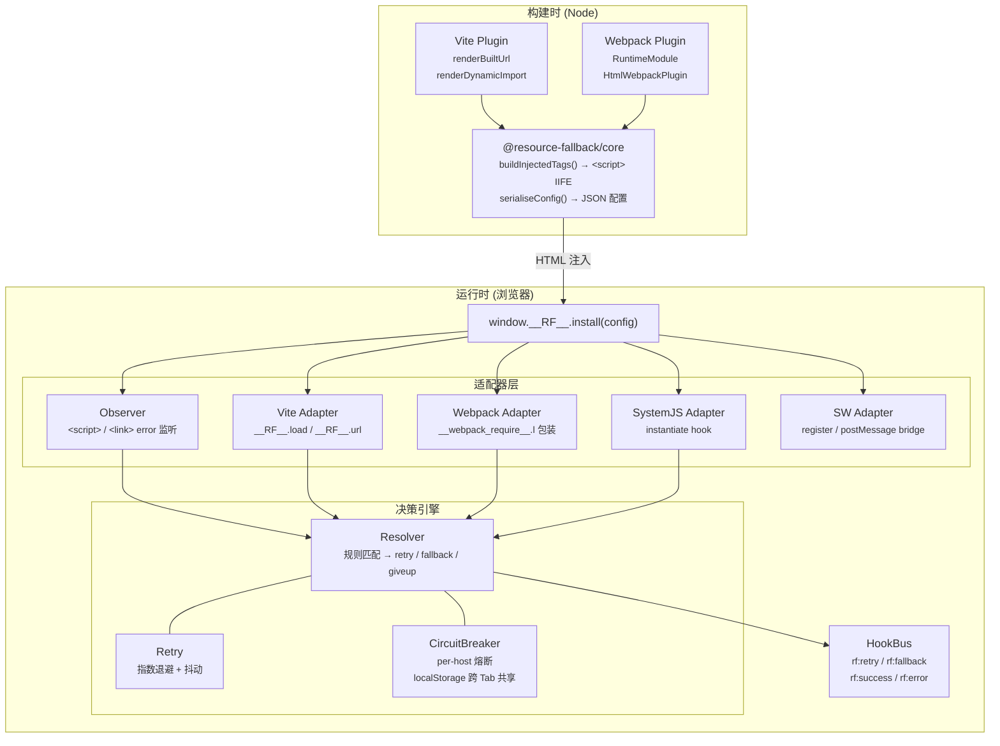
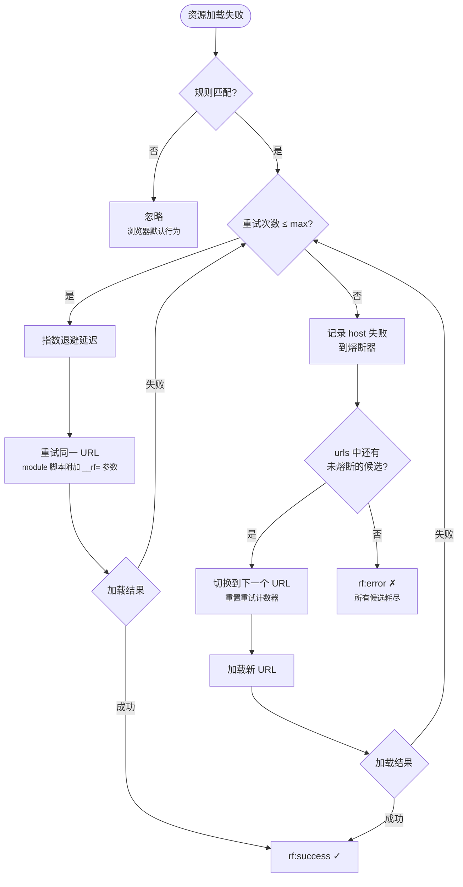

# resource-fallback

[](https://www.npmjs.com/package/@resource-fallback/core)
[](https://www.npmjs.com/package/@resource-fallback/vite-plugin)
[](https://www.npmjs.com/package/@resource-fallback/webpack-plugin)
[](https://github.com/ben-lau/resource-fallback/actions/workflows/ci.yml)
[](https://codecov.io/gh/ben-lau/resource-fallback)

> **[中文](README.md)** | [English](README.en.md)

零心智负担的前端资源回退方案。为 Webpack 与 Vite 构建产物（同步 / 异步 JS、CSS）提供运行时 **重试 → 多 CDN 回退 → 回源** 能力，业务代码无需任何改动。

## 核心特性

- **业务零侵入** — 构建配置注册插件即可。`React.lazy`、Vue `defineAsyncComponent`、Vue Router 懒加载等异步模式完全不需要改动
- **脚本与样式回退** — JS 与 CSS 的同步/异步加载链路拦截（Webpack chunk loader / Vite dynamic import / `<script>` & `<link>` error 事件）
- **Hybrid Service Worker（opt-in）** — 通过 SW 补齐 `img`、`@font-face`、CSS `url()`、媒体资源和受控 CSS `@import` 的资源回退；脚本仍由现有 adapter 负责
- **智能重试** — 指数退避 + 随机抖动，避免失败风暴；可配置每个 URL 的最大重试次数
- **per-host 熔断器** — 连续失败达阈值后自动跳过该 host，冷却后恢复；通过 `localStorage` + `storage` 事件实现跨标签页状态共享
- **三重 Kill Switch** — `window.__RF_DISABLE__` 全局变量 / `?__rf=off` 查询参数 / `__rf_disable=1` Cookie，线上紧急关停无需发版
- **CSP 友好** — 支持 `nonce` 属性与 `externalRuntime` 外链模式
- **SRI 兼容** — 可选 strip / keep / strict 三种策略
- **自动 Preconnect** — 为每个 fallback 域名注入 `<link rel="preconnect">`，减少 DNS + TLS 耗时
- **事件系统** — DOM CustomEvent（`rf:retry` / `rf:fallback` / `rf:success` / `rf:error`）+ JS 函数钩子，便于对接监控上报
- **Module Cache Busting** — ES Module 脚本和 Vite 动态 import 自动添加 `__rf=` 参数绕过浏览器模块缓存
- **SystemJS 支持** — 通过 `System.constructor.prototype.instantiate` hook 为 `@vitejs/plugin-legacy` 等 SystemJS 场景提供回退能力

## 架构总览



### 回退流程



## 包结构

| 包                                                             | 说明                                 | 版本    |
| -------------------------------------------------------------- | ------------------------------------ | ------- |
| [`@resource-fallback/core`](packages/core)                     | 浏览器 IIFE 运行时 + Node 端工具函数 | `0.1.5` |
| [`@resource-fallback/vite-plugin`](packages/vite-plugin)       | Vite 4+ 插件                         | `0.1.5` |
| [`@resource-fallback/webpack-plugin`](packages/webpack-plugin) | Webpack 5+ 插件                      | `0.1.5` |

## 快速上手

### 安装

Vite 项目：

```bash
pnpm add -D @resource-fallback/vite-plugin
```

Webpack 项目：

```bash
pnpm add -D @resource-fallback/webpack-plugin html-webpack-plugin
```

> Webpack 插件依赖 `html-webpack-plugin` 自动注入运行时；如果项目不使用它，需要通过 `@resource-fallback/core` 手动注入 runtime。

### Vite

```ts
// vite.config.ts
import { defineConfig } from 'vite';
import resourceFallback from '@resource-fallback/vite-plugin';

export default defineConfig({
  base: 'https://cdn1.example.com/',
  plugins: [
    resourceFallback({
      rules: [
        {
          match: 'https://cdn1.example.com/',
          urls: [
            'https://cdn2.example.com/',
            'https://backup.example.com/',
            '/', // 回源
          ],
          retry: { max: 2, baseDelay: 300 },
          circuit: { threshold: 3, cooldown: 30000 },
        },
      ],
    }),
  ],
});
```

### Webpack

```js
// webpack.config.js
const HtmlWebpackPlugin = require('html-webpack-plugin');
const { ResourceFallbackWebpackPlugin } = require('@resource-fallback/webpack-plugin');

module.exports = {
  output: {
    publicPath: 'https://cdn1.example.com/',
  },
  plugins: [
    new HtmlWebpackPlugin(),
    new ResourceFallbackWebpackPlugin({
      rules: [
        {
          match: 'https://cdn1.example.com/',
          urls: ['https://cdn2.example.com/', 'https://backup.example.com/', '/'],
        },
      ],
    }),
  ],
};
```

### 上手注意点

1. **`match` 要对齐构建产物前缀**：Vite 对齐 `base`，Webpack 对齐 `output.publicPath`。如果首次资源 URL 匹配不上 `match`，运行时不会进入 retry/fallback。
2. **`urls` 顺序就是回退顺序**：建议写成备用 CDN → 自建静态源 → 回源 `'/'`。最后一个通常放同源回源，避免主 CDN 故障时再次命中 CDN。
3. **Vite dev 不是主要验证环境**：dev server 使用原生 ESM，动态 `import()` 失败无法完整拦截；请用 `vite build && vite preview` 或示例里的 E2E 验证。
4. **入口资源失败要自己兜底 UI**：无论 Vite 还是 Webpack，入口 bundle 如果所有候选 URL 都失败，React/Vue 还没启动；建议在 `index.html` 加一个轻量 `rf:error` 监听显示降级文案。
5. **Hybrid SW 是 opt-in**：需要 `serviceWorker: true` 或对象配置才会接管图片、字体、CSS 背景图等子资源。SW 调试请使用 `localhost` / `127.0.0.1` / HTTPS；普通局域网 IP 的 HTTP 不是 secure context，浏览器不会注册 SW。

## 配置参考

完整 TypeScript 类型见 [`packages/core/src/types.ts`](packages/core/src/types.ts)。

### PluginOptions

| 字段                  | 类型                              | 默认值               | 说明                                                                |
| --------------------- | --------------------------------- | -------------------- | ------------------------------------------------------------------- |
| `rules`               | `FallbackRule[]`                  | **必填**             | 回退规则数组，按顺序匹配，重复 match 以最后一条为准                 |
| `defaults`            | `{ retry?, circuit? }`            | —                    | 所有规则的默认重试/熔断配置                                         |
| `debug`               | `boolean \| 'auto'`               | `'auto'`             | `true` 始终打印日志；`'auto'` 通过 `localStorage.__RF_DEBUG__` 控制 |
| `sri`                 | `'strip' \| 'keep' \| 'strict'`   | `'strip'`            | fallback 时对 `integrity` 属性的处理策略                            |
| `enableDev`           | `boolean`                         | `false`              | 开发模式下是否启用                                                  |
| `nonce`               | `string`                          | —                    | 附加到注入的 `<script>` 标签的 CSP nonce                            |
| `externalRuntime`     | `boolean`                         | `false`              | 将运行时作为外链引入而非内联                                        |
| `externalRuntimePath` | `string`                          | `'/__rf/runtime.js'` | 外链运行时的路径                                                    |
| `injectPreconnect`    | `boolean`                         | `true`               | 为每个 fallback 域名注入 `<link rel="preconnect">`                  |
| `htmlInject`          | `'head-prepend' \| 'head-append'` | `'head-prepend'`     | 注入到 `<head>` 的位置                                              |
| `serviceWorker`       | `boolean \| ServiceWorkerOptions` | `false`              | 启用 Hybrid SW，接管非脚本子资源和受控 CSS `@import`                |
| `hooks`               | `RuntimeHooks`                    | —                    | JS 函数钩子（仅 `externalRuntime` 模式可用）                        |
| `disableGlobals`      | `string[]`                        | `['__RF_DISABLE__']` | 额外的 kill-switch 全局变量名                                       |
| `disableQueryParam`   | `string`                          | `'__rf'`             | 值为 `off` 时禁用运行时的查询参数名                                 |
| `disableCookie`       | `string`                          | `'__rf_disable'`     | 值为 `1` 时禁用运行时的 cookie 名                                   |

### FallbackRule

| 字段      | 类型                                   | 默认值   | 说明                                          |
| --------- | -------------------------------------- | -------- | --------------------------------------------- |
| `match`   | `string \| RegExp \| (url) => boolean` | **必填** | URL 匹配模式。string 为前缀匹配               |
| `urls`    | `string[]`                             | **必填** | 有序候选 URL 前缀列表。最后一个通常为回源地址 |
| `retry`   | `RetryOptions`                         | 见下表   | 覆盖该规则的重试配置                          |
| `circuit` | `CircuitOptions`                       | 见下表   | 覆盖该规则的熔断配置                          |

### RetryOptions

| 字段        | 类型      | 默认值 | 说明                     |
| ----------- | --------- | ------ | ------------------------ |
| `max`       | `number`  | `2`    | 同一 URL 的最大重试次数  |
| `baseDelay` | `number`  | `300`  | 首次重试延迟（ms）       |
| `maxDelay`  | `number`  | `3000` | 指数退避的延迟上限（ms） |
| `jitter`    | `boolean` | `true` | 为延迟添加 ±25% 随机抖动 |

### CircuitOptions

| 字段              | 类型      | 默认值   | 说明                                     |
| ----------------- | --------- | -------- | ---------------------------------------- |
| `threshold`       | `number`  | `5`      | 同一 host 连续失败多少次后触发熔断       |
| `cooldown`        | `number`  | `30000`  | 熔断后冷却时长（ms），到期后重新尝试     |
| `shareAcrossTabs` | `boolean` | `true`   | 通过 `localStorage` 跨标签页共享熔断状态 |
| `storageTtl`      | `number`  | `120000` | localStorage 中熔断条目的存活时长（ms）  |

### ServiceWorkerOptions

Hybrid SW 默认关闭。启用后，Vite/Webpack 插件会生成资源 manifest，并输出 SW asset；SW bundle 会预置 manifest/config（保留 `RegExp` 规则语义），页面 runtime 负责注册 SW、补发配置，并把 SW `postMessage` 事件桥接为现有 `rf:*` 事件。SW 事件会优先按 `FetchEvent.clientId` 定向投递，避免多标签页串台。

```ts
resourceFallback({
  rules: [...],
  serviceWorker: {
    scope: '/',
    includeStyleImports: true,
    fallbackOnOpaque: false,
    cache: { enabled: true, cacheOpaque: false },
  },
});
```

| 字段                  | 类型      | 默认值                                                        | 说明                                                                                                                                             |
| --------------------- | --------- | ------------------------------------------------------------- | ------------------------------------------------------------------------------------------------------------------------------------------------ |
| `enabled`             | `boolean` | `true`（对象配置时）                                          | 设为 `false` 可在对象配置中关闭                                                                                                                  |
| `path`                | `string`  | 跟随 `scope`，如 `/` → `/rf-sw.js`、`/app/` → `/app/rf-sw.js` | SW 文件路径。默认与 scope 同层，避免依赖 `Service-Worker-Allowed` 响应头                                                                         |
| `scope`               | `string`  | `'/'`                                                         | SW 控制范围                                                                                                                                      |
| `includeStyleImports` | `boolean` | `true`                                                        | 允许 SW 在 `request.destination === 'style'` 且 referrer 命中 CSS manifest 时接管 CSS `@import`                                                  |
| `fallbackOnOpaque`    | `boolean` | `false`                                                       | 将跨源 opaque response 视为失败继续 fallback。适合 CDN 错误被浏览器隐藏成 opaque 的图片/CSS 子资源场景；开启后可能跳过本来可用的 opaque CDN 响应 |
| `cache.enabled`       | `boolean` | `true`                                                        | fallback 网络链路成功后写入 Cache API                                                                                                            |
| `cache.cacheOpaque`   | `boolean` | `false`                                                       | 是否缓存 opaque response。默认不缓存                                                                                                             |

缓存策略固定为保守模式：只缓存 fallback 成功后的可读 2xx 响应；网络 retry/fallback 全部失败后，才读取当前 manifest version 对应的 cache 兜底；新 manifest version 激活后会清理旧的 `resource-fallback-*` cache。manifest version 会纳入资源、fallback rules 和关键 SW cache 策略，避免 rules 或 cache 配置变化后继续命中旧 cache。

SW 内部 resolver 的熔断器始终使用独立内存状态，即使页面侧 `defaults.circuit.shareAcrossTabs` 为 `true`，SW 也不会读写 `localStorage`。若 SW fetch 链路最终 reject，会发出 `rf:error` 并返回 `Response.error()`，保持浏览器侧资源表现接近真实 network error。

## 运行时行为

### 事件

| 事件名        | 触发时机                              | detail                  |
| ------------- | ------------------------------------- | ----------------------- |
| `rf:retry`    | 同一 URL 重试                         | `{ url, attempt }`      |
| `rf:fallback` | 切换到下一个候选 URL                  | `{ from, to, reason? }` |
| `rf:success`  | 资源加载成功（经过至少一次重试/回退） | `{ url, attempts }`     |
| `rf:error`    | 所有候选 URL 耗尽                     | `{ url, reason? }`      |

应用代码可通过 `window.addEventListener('rf:fallback', (e) => { ... })` 监听。

### 同步/异步覆盖矩阵

| 场景                       | Webpack                                      | Vite (build/preview)                         | Vite (dev) |
| -------------------------- | -------------------------------------------- | -------------------------------------------- | ---------- |
| 同步 `<script>` / `<link>` | ✓ Observer                                   | ✓ Observer                                   | ✓ Observer |
| 异步 chunk（`import()`）   | ✓ `__webpack_require__.l` hook               | ✓ `__RF__.load` + `renderDynamicImport`      | ✗          |
| CSS 动态注入               | ✓ Observer                                   | ✓ Observer                                   | ✓ Observer |
| SystemJS（legacy bundle）  | ✓ `instantiate` hook                         | ✓ `instantiate` hook                         | —          |
| 图片 / 字体 / 媒体资源     | ✓ Hybrid SW（opt-in，受控页面）              | ✓ Hybrid SW（opt-in，受控页面）              | ✗          |
| CSS `url()` / `@font-face` | ✓ Hybrid SW（opt-in，受控页面）              | ✓ Hybrid SW（opt-in，受控页面）              | ✗          |
| CSS `@import`              | ✓ Hybrid SW（需 CSS referrer 命中 manifest） | ✓ Hybrid SW（需 CSS referrer 命中 manifest） | ✗          |

> Vite dev 模式使用原生 ESM，无法拦截动态 import 失败。请使用 `vite preview` 或生产构建验证回退逻辑。
> SW 无法保证首次访问已经控制页面；首次 HTML 解析期间发出的早期请求仍依赖现有页面 runtime/adapter 兜底。
> SW 只接管触发 fetch 的页面客户端；没有 `clientId` 的极少数场景才会回退为窗口广播。

## CSP 指南

运行时默认以**内联 `<script>`** 注入 `<head>`，需要配合 CSP 使用：

```ts
// 方式一：通过 nonce
resourceFallback({ nonce: 'XYZ123', ... })
// CSP: script-src 'nonce-XYZ123' https://cdn1.example.com https://cdn2.example.com;

// 方式二：外链运行时（无需 nonce）
resourceFallback({
  externalRuntime: true,
  externalRuntimePath: '/static/__rf/runtime.js',
  ...
})
```

外链模式需自行部署 `runtime.js`，可通过 `getRuntimeCode()` 获取文件内容。

## SRI 策略

| 策略            | 行为                                                                  |
| --------------- | --------------------------------------------------------------------- |
| `strip`（默认） | fallback 时移除 `integrity` 属性，因为不同 CDN 的文件 hash 通常不匹配 |
| `keep`          | 保留属性，浏览器校验不匹配时触发 error，继续下一个回退                |
| `strict`        | 同 `keep`，语义化更明确                                               |

> 若需在所有 CDN 上保留 SRI，请确保**同一文件在所有 CDN 上的 hash 一致**（推荐：将构建产物同步到多个对象存储桶）。

## Kill Switch

三种方式可在不发版的情况下紧急禁用运行时：

| 方式     | 示例                           | 适用场景                         |
| -------- | ------------------------------ | -------------------------------- |
| 全局变量 | `window.__RF_DISABLE__ = true` | 在运行时 `<script>` 之前内联设置 |
| 查询参数 | 访问 `?__rf=off`               | 临时排查问题                     |
| Cookie   | `__rf_disable=1`               | 网关按会话/用户维度禁用          |

## 同步脚本限制

`<script>`（非 module）失败后，浏览器只触发 `error` 事件，**已执行的部分不可撤回**。插件会替换 DOM 为下一个 URL 并重新加载，但如果原脚本已挂载全局变量，再次执行可能产生副作用。所有候选 URL 耗尽后**仅触发 `rf:error`，不自动刷新页面**——由业务决定如何兜底。

Hybrid SW 不在本轮接管 script，也不实现同步 classic script 的强顺序保证。若后续需要强顺序，应作为独立的 opt-in ScriptSequencer 能力设计：构建期把阻塞脚本改写成队列，运行时按 DOM 顺序串行完成 retry/fallback 后再继续下一个脚本。

## 监控接入

推荐通过 DOM 事件对接监控系统：

```ts
window.addEventListener('rf:retry', (e) => {
  monitor.send('resource.retry', e.detail);
});
window.addEventListener('rf:fallback', (e) => {
  monitor.send('resource.fallback', e.detail);
});
window.addEventListener('rf:error', (e) => {
  monitor.send('resource.error', e.detail);
});
```

或通过 `hooks`（需要 `externalRuntime: true`，因为函数无法 JSON 序列化）：

```ts
window.__RF__.install({
  rules: [...],
  hooks: {
    onError:    (e) => sentry.captureMessage('rf.error', e),
    onFallback: (e) => analytics.send('rf.fallback', e),
  },
});
```

## Demo

- [`examples/vite-vue`](examples/vite-vue) — Vue 3 + Vite 5 + Vue Router 懒加载
- [`examples/webpack-react`](examples/webpack-react) — React 18 + Webpack 5 + `React.lazy`

两个 demo 使用 `.invalid` 域名（RFC 2606 保留，DNS 必然失败）作为 CDN，origin 使用 `/`（同源），**无需 mock 服务器**。

```bash
pnpm install
pnpm build

# Vite + Vue
pnpm --filter @resource-fallback-example/vite-vue build
pnpm --filter @resource-fallback-example/vite-vue start   # http://127.0.0.1:4174

# Webpack + React
pnpm --filter @resource-fallback-example/webpack-react build
pnpm --filter @resource-fallback-example/webpack-react start   # http://127.0.0.1:4173
```

打开 DevTools → Network 可以看到完整的重试→回退→回源链路。页面内的事件面板实时展示所有事件。

## 最佳实践

1. **`urls` 顺序就是回退顺序** — 建议依次写入：备用 CDN → 自建 CDN → 回源（`/`）
2. **`match` 应等于 `base` / `publicPath`** — 确保首次加载的资源 URL 能被规则匹配
3. **回源 URL 使用相对路径** — 避免再次遇到 CDN 故障（如 `'/'`）
4. **生产环境保持 `debug: 'auto'`** — 线上排查时设置 `localStorage.__RF_DEBUG__ = '1'` 即可看日志
5. **`retry.max` 不宜过大** — 过多重试会延长用户等待时间，建议 1~3 次
6. **为入口失败兜底** — 在 `index.html` 中添加 `rf:error` 监听，显示降级 UI（参见 examples）

## 开发

```bash
pnpm install
pnpm build          # 构建所有 packages
pnpm test           # Vitest 单测
pnpm test:coverage  # Vitest 覆盖率检查（含阈值）
pnpm typecheck      # TypeScript 类型检查
```

### E2E 测试

```bash
pnpm --filter @resource-fallback-example/vite-vue test:e2e
pnpm --filter @resource-fallback-example/webpack-react test:e2e
```

### 发布流程（release-please）

本项目使用 [release-please](https://github.com/googleapis/release-please) 全自动管理版本号和 changelog：

1. 正常提交代码到 `main`（使用 conventional commits 格式）
2. release-please 自动创建/更新一个 **Release PR**（包含版本号 bump + CHANGELOG 更新）
3. 想要发版时，合并该 Release PR → 自动创建 GitHub Release + git tag
4. npm 发布：

```bash
pnpm release                # build + publish 所有包到 npm
```

## TODO

以下是后续的升级点、优化点和当前的不足，按优先级排列：

### 功能增强

- [ ] **（高优先级）单次加载超时 / `retry.timeout`** — 已从公开类型中移除未实现的 `RetryOptions.timeout`。后续需在各加载路径（Observer、`__RF__.load`、webpack chunk 等）落地「超过 N ms 视为失败并驱动 resolver」；可选配合 `fetch`+`AbortSignal` 或 HEAD 预检；经典 `<script>` 无原生超时 API，需单独权衡实现。
- [x] **Hybrid Service Worker 拦截模式（opt-in）** — SW 负责 `image`、`font`、`media`、CSS `url()` 和受控 CSS `@import`；现有 Observer/Vite/Webpack/SystemJS adapter 继续负责 script 与构建器语义
- [x] **图片/字体资源支持（SW 模式）** — 已在 Hybrid SW 中覆盖 ``、`@font-face`、CSS 背景图和媒体资源；仍需满足浏览器 CORS/MIME/SRI 等安全策略
- [ ] **Vite dev 模式支持** — 当前 Vite dev 使用原生 ESM，动态 import 失败无法拦截
- [ ] **per-rule 熔断器** — 当前所有规则共享同一个熔断器实例，无法按规则独立配置不同的熔断阈值
- [ ] **动态规则更新** — `install()` 是一次性的，无法在运行时动态添加/修改规则。考虑增加 `addRule()` / `removeRule()` API
- [ ] **Rspack / esbuild 插件** — 扩展构建工具支持
- [ ] **SSR 资源预取回退** — 服务端渲染场景下的资源 URL 替换

### 可靠性

- [ ] **同步脚本执行顺序保证** — 当前同步 `<script>` 失败后的替换无法保证与后续脚本的执行顺序，可能导致依赖关系断裂
- [x] **CSS `@import` 级联失败（受控场景）** — Hybrid SW 在 `includeStyleImports` 开启且 referrer 命中 CSS manifest 时接管；未受 SW 控制的首次访问仍不保证覆盖
- [ ] **Worker / SharedWorker 中的资源加载** — 当前运行时依赖 DOM API，无法在 Worker 环境工作

### 开发体验

- [ ] **Chrome DevTools 扩展** — 可视化展示回退链路、熔断器状态、事件时间线
- [ ] **性能指标上报** — 内置 `performance.mark` / `performance.measure`，量化回退对加载时间的影响
- [ ] **配置校验** — 构建时校验 `match` 与 `base`/`publicPath` 是否匹配，提前发现配置错误
- [ ] **更完善的日志** — 区分 debug / info / warn / error 级别，支持自定义 logger

### 文档

- [ ] **API Reference 独立文档站** — 基于 TypeDoc 或 VitePress 生成
- [ ] **迁移指南** — 从无回退方案迁移的步骤
- [ ] **常见问题 FAQ** — 收集社区反馈的典型问题

## 许可证

MIT
