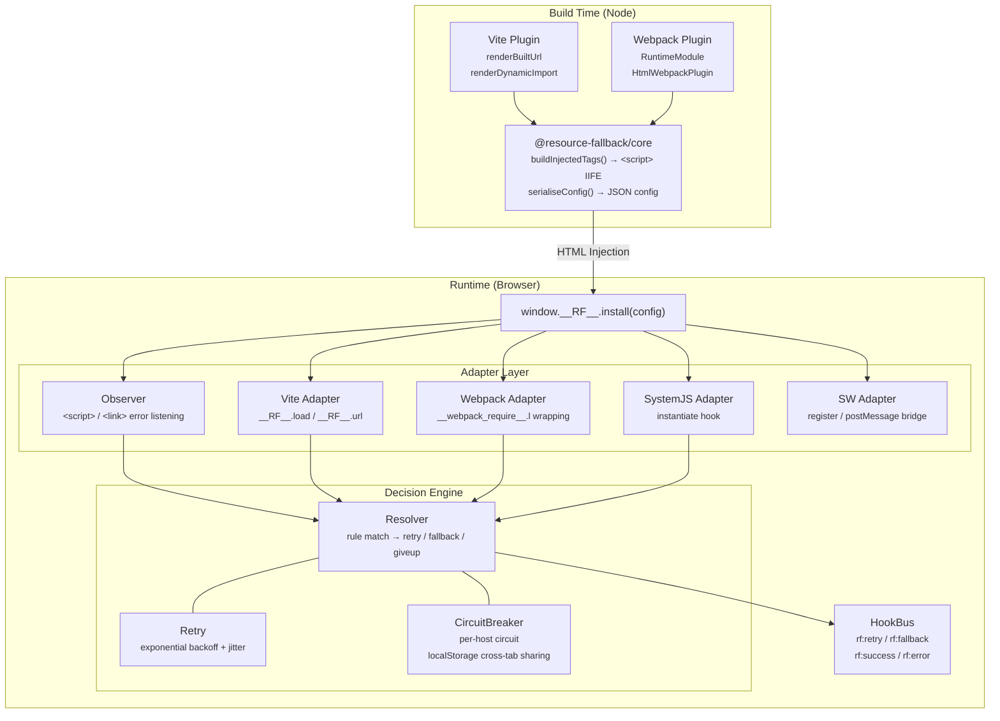
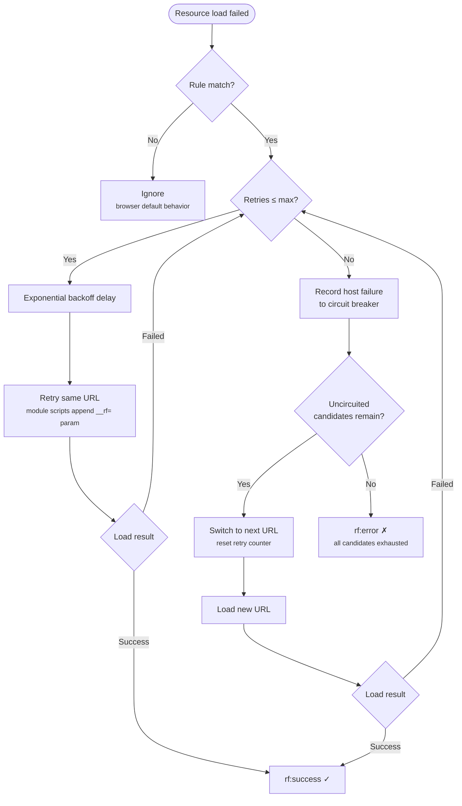

# Introduction

## What is resource-fallback

**resource-fallback** is a zero-mental-overhead frontend resource fallback solution. It provides runtime **retry → multi-CDN fallback → origin** capabilities for Webpack and Vite build outputs (sync / async JS, CSS) — no changes to business code required.

The project ships three npm packages:

| Package                             | Description                                   |
| ----------------------------------- | --------------------------------------------- |
| `@resource-fallback/core`           | Browser IIFE runtime + Node utility functions |
| `@resource-fallback/vite-plugin`    | Vite 4+ plugin                                |
| `@resource-fallback/webpack-plugin` | Webpack 5+ plugin                             |

## Why resource fallback matters

Frontend static assets are usually served from CDNs. When the primary CDN hits DNS failures, network jitter, or regional outages, pages can white-screen, lose styles, or fail lazy-loaded modules.

Traditional approaches require manual failure handling in business code or complex gateway routing. resource-fallback **injects a runtime at build time and intercepts failures automatically**, retrying the same URL, switching to backup CDNs, and finally falling back to origin — all transparent to application code.

::: tip Use cases

- Multi-CDN disaster recovery and primary/backup switching
- Automatic degradation when static assets fail to load
- Monitoring and observability for fallback chains
  :::

## Architecture overview

### Fallback flow

## Package structure

| Package                                                                                                | Description                                   | Version |
| ------------------------------------------------------------------------------------------------------ | --------------------------------------------- | ------- |
| [`@resource-fallback/core`](https://www.npmjs.com/package/@resource-fallback/core)                     | Browser IIFE runtime + Node utility functions | `0.1.5` |
| [`@resource-fallback/vite-plugin`](https://www.npmjs.com/package/@resource-fallback/vite-plugin)       | Vite 4+ plugin                                | `0.1.5` |
| [`@resource-fallback/webpack-plugin`](https://www.npmjs.com/package/@resource-fallback/webpack-plugin) | Webpack 5+ plugin                             | `0.1.5` |

### @resource-fallback/core

Core runtime and build utilities:

- **Resolver** — rule matching, retry / fallback decisions
- **Retry** — exponential backoff + jitter
- **CircuitBreaker** — per-host circuit with optional localStorage cross-tab sharing
- **Observer** — listens for `<script>` / `<link>` error events
- **Adapters** — Vite / Webpack / SystemJS / SW adapters
- **buildInjectedTags()** — generates HTML injection tags
- **getRuntimeCode()** — returns IIFE runtime source

### @resource-fallback/vite-plugin

Vite build integration — see [Vite Integration](./vite.md):

- `renderBuiltUrl` static asset URL rewriting
- `renderDynamicImport` + `writeBundle` dynamic import wrapping
- `transformIndexHtml` HTML injection
- Optional Hybrid SW asset generation

### @resource-fallback/webpack-plugin

Webpack build integration — see [Webpack Integration](./webpack.md):

- `RuntimeModule` injection, patches `__webpack_require__.l`
- `html-webpack-plugin` HTML injection integration
- Optional Hybrid SW asset generation

## Next steps

- [Quick Start](./quick-start.md) — installation and minimal config
- [Configuration Reference](./configuration.md) — full options
- [Hybrid Service Worker](./service-worker.md) — image, font, and subresource fallback
