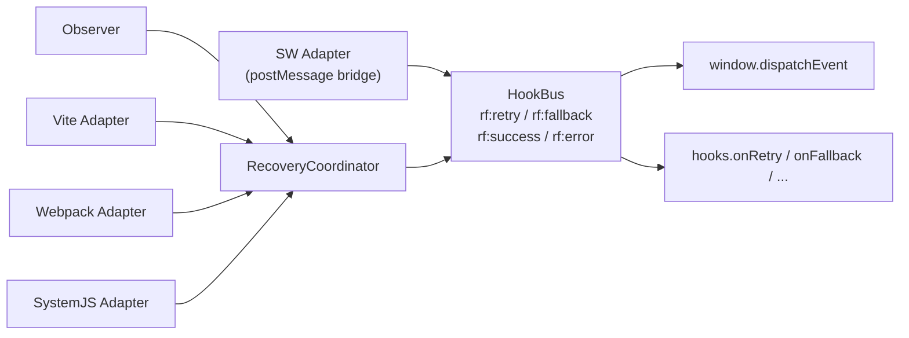

# Runtime Events

resource-fallback exposes DOM CustomEvents and optional JS function hooks for monitoring, alerting, and degraded UI. In auto-injected setups, prefer DOM events because function values in build config are dropped during serialization.

## Event reference

| Event         | When fired                                           | `detail` fields         |
| ------------- | ---------------------------------------------------- | ----------------------- |
| `rf:retry`    | Same URL is retried                                  | `{ url, attempt }`      |
| `rf:fallback` | Switched to next candidate URL                       | `{ from, to, reason? }` |
| `rf:success`  | A recovered page-side session completes successfully | `{ url, attempts }`     |
| `rf:error`    | A page-side session fails, or an SW error is bridged | `{ url, reason? }`      |

::: info Event sources
Page-side adapters (Observer, Vite, Webpack, SystemJS) hand failures to the RecoveryCoordinator, and the HookBus emits the DOM events. In Hybrid SW mode, the SW posts events back to the page, and the page runtime re-emits the same `rf:*` names.

- For page Coordinator events, `ErrorEvent.reason` is an opaque `unknown` failure value from the transport/coordinator.
- For SW-bridged events, `reason` may include resolver giveup reasons such as `'rules-exhausted'` or `'no-match'`.
- Page `rf:success` is published only after a recovery session succeeds; it is not emitted for an initial first-try success.
- SW `rf:success` is emitted for any usable SW response, including an initial successful fetch.
  :::

## DOM listener examples

### Basic logging

```ts
window.addEventListener('rf:retry', (e) => {
  console.log('[RF] retry', e.detail);
});

window.addEventListener('rf:fallback', (e) => {
  console.log('[RF] fallback', e.detail.from, '→', e.detail.to);
});

window.addEventListener('rf:success', (e) => {
  console.log('[RF] success', e.detail.url, 'after', e.detail.attempts, 'attempts');
});

window.addEventListener('rf:error', (e) => {
  console.error('[RF] error', e.detail);
});
```

### Degraded UI for entry failures

Place early in `index.html` before the app bundle:

```html
<script>
  window.addEventListener('rf:error', function () {
    document.body.innerHTML =
      '<p style="padding:2rem;text-align:center">Resources failed to load. Please refresh.</p>';
  });
</script>
```

Keep this entry fallback generic. Page-side `rf:error.detail.reason` is not a stable reason-string contract; if you need proof that fallback actually ran, watch `rf:retry` / `rf:fallback` separately.

### Detect whether fallback actually ran

When testing non-matching URLs, only count `retry` or `fallback` as "intercepted":

```ts
const events: Array<{ type: string; detail: unknown }> = [];

['rf:retry', 'rf:fallback', 'rf:success', 'rf:error'].forEach((type) => {
  window.addEventListener(type, (e) => {
    events.push({ type, detail: (e as CustomEvent).detail });
  });
});

function didFallbackRun(since: number) {
  return events.slice(since).some((e) => e.type === 'rf:retry' || e.type === 'rf:fallback');
}
```

## JS function hooks

If you need function hooks, call `window.__RF__.install()` manually in page code so you can pass live function objects directly:

```ts
window.__RF__.install({
  rules: [...],
  hooks: {
    onRetry:    (e) => monitor.send('resource.retry', e),
    onFallback: (e) => monitor.send('resource.fallback', e),
    onSuccess:  (e) => monitor.send('resource.success', e),
    onError:    (e) => monitor.send('resource.error', e),
  },
});
```

::: warning Hook serialization limits
`buildInjectedTags()` and plugin-generated `window.__RF__.install(...)` calls always serialize the config before it reaches the page, so function hooks from build config are dropped. `externalRuntime` only changes whether the runtime script is inline or external; it does not preserve those functions. For auto-injected setups, use DOM `rf:*` events instead.
:::

## Monitoring integration

Recommended pattern — hook DOM events:

```ts
window.addEventListener('rf:retry', (e) => {
  monitor.send('resource.retry', e.detail);
});
window.addEventListener('rf:fallback', (e) => {
  monitor.send('resource.fallback', e.detail);
});
window.addEventListener('rf:error', (e) => {
  monitor.send('resource.error', e.detail);
});
```

### Dashboard suggestions

| Metric          | Source                                                       |
| --------------- | ------------------------------------------------------------ |
| Retry rate      | `rf:retry` count by host                                     |
| Fallback rate   | `rf:fallback` `from` → `to`                                  |
| Terminal errors | `rf:error` count                                             |
| Exhaustion rate | SW-bridged `rf:error` where `reason === 'rules-exhausted'`   |
| Circuit trips   | host skipped in fallback chain (via logging + circuit state) |

### Hybrid SW events

SW events are bridged to the same `rf:*` events on the page that triggered the fetch (`clientId`). Rare requests without `clientId` fall back to window broadcast.

Reason strings such as `rules-exhausted` / `no-match` should stay explicitly scoped to those SW-bridged resolver events, not to page-side `rf:error` as a general API contract.

## HookBus and adapter relationship



## Debug mode

Set `debug: 'auto'` (default) and enable at runtime:

```js
localStorage.__RF_DEBUG__ = '1';
location.reload();
```

## Related docs

- [Best Practices](./best-practices.md)
- [CSP & SRI](./csp-sri.md)
- [Configuration Reference](./configuration.md)
