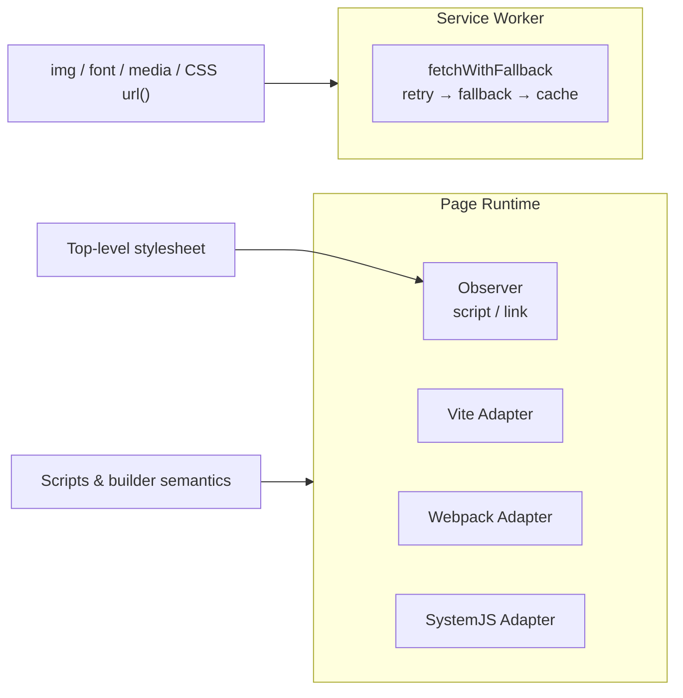

# Hybrid Service Worker

Hybrid Service Worker is an **opt-in** extension that covers subresources DOM Observer cannot see: `img`, `@font-face`, CSS `url()`, media resources, and controlled CSS `@import`. Scripts remain owned by existing page-side adapters (Observer, Vite, Webpack, SystemJS).

## Overview

| Resource type                                                | Owner                 |
| ------------------------------------------------------------ | --------------------- |
| Scripts, dynamic import, Webpack async chunk, SystemJS       | Page runtime adapters |
| Images, fonts, media, CSS subresources, controlled `@import` | Hybrid SW (opt-in)    |
| Top-level `<link rel="stylesheet">`                          | Observer              |

This split avoids duplicate retry, event ordering issues, and breaking builder Promise semantics.

## Manifest preloading

At build time, Vite/Webpack plugins generate a `ResourceFallbackManifest` and embed it in the SW file via `self.__RF_SW_PRELOAD__`:

- SW has ownership info **before the first fetch event**
- Page runtime still `postMessage`s updated config as a follow-up channel
- `RegExp` rules use JS expression serialization (plain `JSON.stringify` would turn them into `{}`)

Manifest version includes resources, fallback rules, and cache policy. On `activate`, old `resource-fallback-*` caches are cleaned.

## Ownership model



SW events are delivered to the triggering page first via `FetchEvent.clientId`, avoiding cross-tab event leakage.

## Configuration

Enable with `serviceWorker: true` or an object:

```ts
resourceFallback({
  rules: [
    {
      match: 'https://cdn.example.com/',
      urls: ['https://cdn-backup.example.com/', '/'],
    },
  ],
  serviceWorker: {
    scope: '/',
    includeStyleImports: true,
    fallbackOnOpaque: false,
    cache: { enabled: true, cacheOpaque: false },
  },
});
```

| Field                 | Default                                | Notes                                                       |
| --------------------- | -------------------------------------- | ----------------------------------------------------------- |
| `path`                | Derived from scope (`/` → `/rf-sw.js`) | Stays inside scope to avoid `Service-Worker-Allowed` header |
| `includeStyleImports` | `true`                                 | CSS `@import` when referrer matches manifest CSS asset      |
| `fallbackOnOpaque`    | `false`                                | Opt-in: treat opaque cross-origin responses as failure      |
| `cache.enabled`       | `true`                                 | Cache successful fallback 2xx responses only                |

Full reference: [Configuration Reference](./configuration.md#serviceworkeroptions).

::: info SW circuit breaker
SW uses an isolated in-memory circuit breaker — it does not share page-side `localStorage` state.
:::

## Registration flow

1. Build emits `rf-sw.js` + manifest
2. Page runtime registers SW and bridges `postMessage` → `rf:*` DOM events
3. SW intercepts fetch for manifest-owned resources
4. On ultimate failure: emit `rf:error`, return `Response.error()`

## Caveats

### Secure context required

SW registration requires a secure context: `https://`, `http://localhost`, or `http://127.0.0.1`. Plain HTTP LAN IPs (e.g. `http://192.168.x.x`) **cannot** register SW.

### First visit not fully covered

SW registration is async. Early requests during initial HTML parsing may complete before SW controls the page. Page runtime and Observer still handle first-lifecycle DOM failures.

### Opaque responses

Cross-origin images often use `no-cors`. SW may only see opaque responses without readable status. By default opaque responses are **not** treated as failure. Enable `fallbackOnOpaque` when CDN errors appear as opaque (may skip usable opaque CDN images).

### SW persistence during development

After rebuild, an old SW may still control the tab. Clear registrations when debugging:

```js
await Promise.all((await navigator.serviceWorker.getRegistrations()).map((r) => r.unregister()));
await caches.keys().then((keys) => Promise.all(keys.map((k) => caches.delete(k))));
location.reload();
```

Check the active controller:

```js
navigator.serviceWorker.controller?.scriptURL;
```

### Verify resources actually loaded

- **Images**: `img.naturalWidth > 0`
- **Fonts**: `await document.fonts.ready` + `document.fonts.check(...)`
- **Background images**: computed style alone is not enough — check Network / SW events

::: warning Kill switch
When runtime is disabled via kill switch, verify whether SW should pass-through or stop handling — see [CSP & SRI](./csp-sri.md#kill-switch).
:::

## Related docs

- [SW Fallback Comparison](../design/sw-comparison.md) — design rationale
- [Configuration Reference](./configuration.md)
- [Runtime Events](./runtime-events.md)
