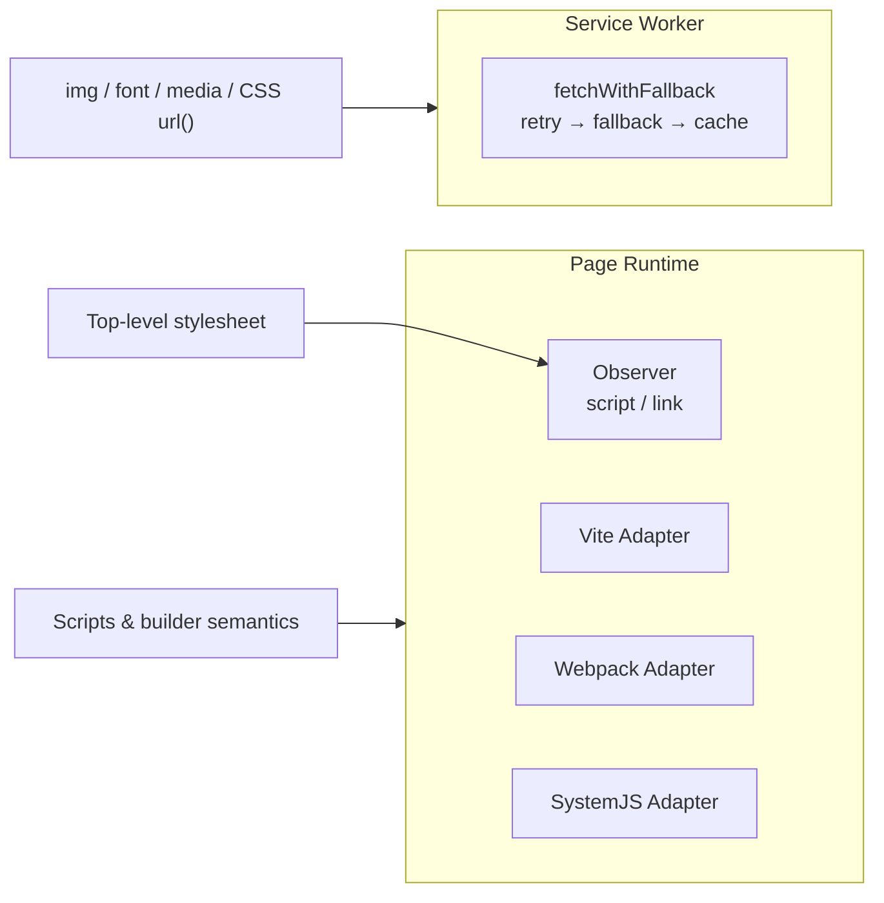

# Hybrid Service Worker

Hybrid Service Worker is an **opt-in** extension that covers subresources DOM Observer cannot see: `img`, `@font-face`, CSS `url()`, media resources, and controlled CSS `@import`. Page-side script and builder recovery still runs through `RecoveryCoordinator` plus the existing Observer/Vite/Webpack/SystemJS adapters.

## Overview

::: info Current implementation status
Hybrid SW is already shipped as an opt-in feature. Vite/Webpack plugins generate a manifest, emit an SW asset, preload manifest into the worker bundle, and the page runtime still handles SW registration, follow-up config updates, and `postMessage` → `rf:*` DOM event bridging.
:::

| Resource type                                                | Owner                                                                 | Notes                                          |
| ------------------------------------------------------------ | --------------------------------------------------------------------- | ---------------------------------------------- |
| Scripts, dynamic import, Webpack async chunk, SystemJS       | Page runtime (`RecoveryCoordinator` + Observer/Vite/Webpack/SystemJS) | Keeps script and builder semantics on the page |
| Images, fonts, media, CSS subresources, controlled `@import` | Hybrid SW resolver (opt-in)                                           | Fetch-layer fallback in the worker             |
| Top-level `<link rel="stylesheet">`                          | Observer                                                              | Still a page-owned DOM boundary                |

This split avoids duplicate retry, event ordering issues, and breaking builder Promise semantics. The page runtime and the SW do not share one recovery state machine: page adapters delegate to `RecoveryCoordinator`, while the SW keeps its own fetch-layer resolver.

## Enable it

```ts
resourceFallback({
  rules: [...],
  serviceWorker: true,
});

resourceFallback({
  rules: [...],
  serviceWorker: {
    scope: '/',
    includeStyleImports: true,
    fallbackOnOpaque: false,
    cache: { enabled: true, cacheOpaque: false },
  },
});
```

## Manifest preloading

At build time, Vite/Webpack plugins generate a `ResourceFallbackManifest` and embed it in the SW file via `self.__RF_SW_PRELOAD__`:

- SW has ownership info **before the first fetch event**
- Page runtime still `postMessage`s updated config as a follow-up channel
- Rules use string `base` prefixes (no RegExp / function matchers)
- Preload is plain `JSON.stringify` (rules are normalized with trailing slashes at build time)

Manifest version includes resources, fallback rules, and cache policy. On `activate`, old `resource-fallback-*` caches are cleaned.

## Ownership model


```mermaid
flowchart LR
  subgraph page["Page Runtime"]
    OBS["Observer<br/>script / link"]
    VA["Vite Adapter"]
    WA["Webpack Adapter"]
    SA["SystemJS Adapter"]
  end

  subgraph sw["Service Worker"]
    FETCH["fetchWithFallback<br/>retry → fallback → cache"]
  end

  SCRIPTS["Scripts & builder semantics"] --> page
  SUBRES["img / font / media / CSS url()"] --> sw
  TOPCSS["Top-level stylesheet"] --> OBS
```

SW events are delivered to the triggering page first via `FetchEvent.clientId`, avoiding cross-tab event leakage.

On the page side, duplicate takeover is prevented by the ownership registry: one owner claims a `logicalKey`, and concurrent work from the same owner joins the same in-flight recovery Promise through `RecoveryCoordinator`.

## Event bridge

SW cannot call `window.dispatchEvent()` directly. It posts events back to the page client, and the page runtime re-emits them as the same DOM CustomEvents: `rf:retry`, `rf:fallback`, `rf:success`, and `rf:error`.

## Configuration

Enable with `serviceWorker: true` or an object:

```ts
resourceFallback({
  rules: [
    {
      base: 'https://cdn.example.com/',
      urls: ['https://cdn-backup.example.com/', '/'],
    },
  ],
  serviceWorker: {
    scope: '/',
    includeStyleImports: true,
    fallbackOnOpaque: false,
    cache: { enabled: true, cacheOpaque: false },
  },
});
```

| Field                 | Default                                | Notes                                                                                |
| --------------------- | -------------------------------------- | ------------------------------------------------------------------------------------ |
| `path`                | Derived from scope (`/` → `/rf-sw.js`) | Stays inside scope to avoid `Service-Worker-Allowed` header                          |
| `includeStyleImports` | `true`                                 | CSS `@import` when referrer matches manifest CSS asset                               |
| `fallbackOnOpaque`    | `false`                                | CORS-probe cross-origin `no-cors` requests; CORS-unavailable responses remain opaque |
| `cache.enabled`       | `true`                                 | Cache successful fallback responses; opaque needs `cacheOpaque`                      |

Full reference: [Configuration Reference](./configuration.md#serviceworkeroptions).

::: info SW circuit breaker
SW uses an isolated in-memory circuit breaker — it does not share page-side `localStorage` state.
:::

## Cache policy

- Cache only readable 2xx responses from successful fallback by default; `cacheOpaque: true` also permits opaque responses
- Read the current manifest-version cache only after network retry/fallback is exhausted
- Clean old `resource-fallback-*` caches when a new manifest version activates

## Registration flow

1. Build emits `rf-sw.js` + manifest
2. Page runtime registers SW and bridges `postMessage` → `rf:*` DOM events
3. SW intercepts fetch for manifest-owned resources
4. On ultimate failure: emit `rf:error`, return `Response.error()`

## Caveats

### Secure context required

SW registration requires a secure context: `https://`, `http://localhost`, or `http://127.0.0.1`. Plain HTTP LAN IPs (e.g. `http://192.168.x.x`) **cannot** register SW.

### First visit not fully covered

SW registration is async. Early requests during initial HTML parsing may complete before SW controls the page. Page runtime and Observer still handle first-lifecycle DOM failures.

### Opaque responses

Cross-origin images often use `no-cors`. SW may only see opaque responses without readable status. By default opaque responses are **not** treated as failure. With `fallbackOnOpaque`, the SW first probes with CORS: readable non-2xx responses trigger retry/fallback, while a CORS failure downgrades to `no-cors` and accepts the opaque response. Therefore this option does not guarantee fallback for every opaque HTTP error.

### SW persistence during development

After rebuild, an old SW may still control the tab. Clear registrations when debugging:

```js
await Promise.all((await navigator.serviceWorker.getRegistrations()).map((r) => r.unregister()));
await caches.keys().then((keys) => Promise.all(keys.map((k) => caches.delete(k))));
location.reload();
```

Check the active controller:

```js
navigator.serviceWorker.controller?.scriptURL;
```

### Verify resources actually loaded

- **Images**: `img.naturalWidth > 0`
- **Fonts**: `await document.fonts.ready` + `document.fonts.check(...)`
- **Background images**: computed style alone is not enough — check Network / SW events

::: warning Kill switch
Page kill switches such as `window.__RF_DISABLE__`, query flags, or cookies only stop the **current page runtime installation path** from wiring itself up. They do **not** unregister, reconfigure, or take control over an already registered Service Worker, and they do **not** guarantee that the SW will immediately pass through requests. If you need SW behavior to stop or change, manage SW registration, updates, and configuration separately.
:::

## Related docs

- [SW Fallback Comparison](../design/sw-comparison.md) — design rationale
- [Configuration Reference](./configuration.md)
- [Runtime Events](./runtime-events.md)
