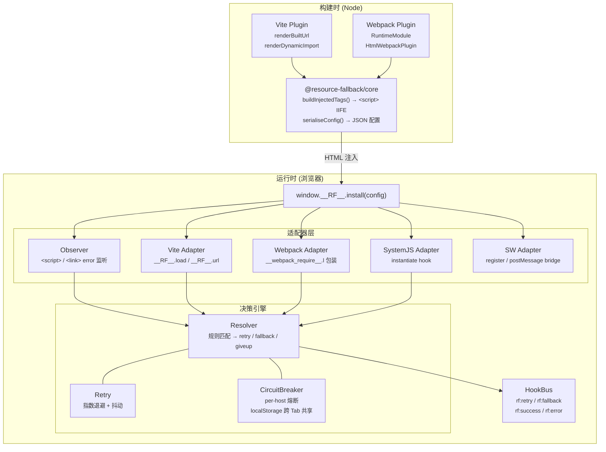
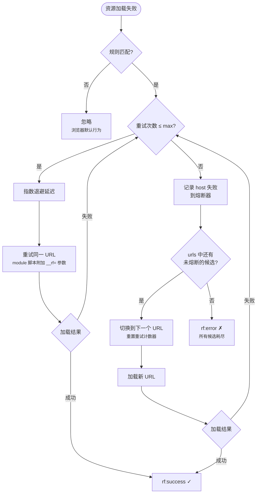

# 简介

## 什么是 resource-fallback

**resource-fallback** 是一个零心智负担的前端资源回退方案。它为 Webpack 与 Vite 构建产物（同步 / 异步 JS、CSS）提供运行时 **重试 → 多 CDN 回退 → 回源** 能力，业务代码无需任何改动。

项目包含三个 npm 包：

| 包                                  | 说明                                 |
| ----------------------------------- | ------------------------------------ |
| `@resource-fallback/core`           | 浏览器 IIFE 运行时 + Node 端工具函数 |
| `@resource-fallback/vite-plugin`    | Vite 4+ 插件                         |
| `@resource-fallback/webpack-plugin` | Webpack 5+ 插件                      |

## 为什么需要资源回退

前端静态资源通常托管在 CDN 上。当主 CDN 出现 DNS 故障、网络抖动或区域性不可用时，页面可能出现白屏、样式丢失或懒加载模块失败。

传统做法需要在业务代码中手动处理加载失败，或在网关层做复杂路由。resource-fallback 在**构建时注入运行时、运行时自动拦截失败**，按配置依次重试同一 URL、切换到备用 CDN、最终回源，整个过程对业务透明。

::: tip 适用场景

- 多 CDN 容灾与主备切换
- 静态资源加载失败时的自动降级
- 需要监控上报的资源 fallback 链路
  :::

## 核心架构总览

### 回退流程

## 包结构

| 包                                                                                                     | 说明                                 | 版本    |
| ------------------------------------------------------------------------------------------------------ | ------------------------------------ | ------- |
| [`@resource-fallback/core`](https://www.npmjs.com/package/@resource-fallback/core)                     | 浏览器 IIFE 运行时 + Node 端工具函数 | `0.1.5` |
| [`@resource-fallback/vite-plugin`](https://www.npmjs.com/package/@resource-fallback/vite-plugin)       | Vite 4+ 插件                         | `0.1.5` |
| [`@resource-fallback/webpack-plugin`](https://www.npmjs.com/package/@resource-fallback/webpack-plugin) | Webpack 5+ 插件                      | `0.1.5` |

### @resource-fallback/core

核心运行时与构建工具：

- **Resolver** — 规则匹配、retry / fallback 决策
- **Retry** — 指数退避 + 抖动
- **CircuitBreaker** — per-host 熔断，支持 localStorage 跨 Tab 共享
- **Observer** — 监听 `<script>` / `<link>` 的 error 事件
- **Adapter** — Vite / Webpack / SystemJS / SW 适配器
- **buildInjectedTags()** — 生成注入 HTML 的标签
- **getRuntimeCode()** — 获取 IIFE 运行时源码

### @resource-fallback/vite-plugin

Vite 构建集成，详见 [Vite 集成](./vite.md)：

- `renderBuiltUrl` 静态资源 URL 改写
- `renderDynamicImport` + `writeBundle` 动态 import 包装
- `transformIndexHtml` HTML 注入
- 可选 Hybrid SW 资产生成

### @resource-fallback/webpack-plugin

Webpack 构建集成，详见 [Webpack 集成](./webpack.md)：

- `RuntimeModule` 注入，patch `__webpack_require__.l`
- `html-webpack-plugin` 集成 HTML 注入
- 可选 Hybrid SW 资产生成

## 下一步

- [快速开始](./quick-start.md) — 安装与最小配置
- [配置参考](./configuration.md) — 完整选项说明
- [Hybrid Service Worker](./service-worker.md) — 图片、字体等子资源回退
