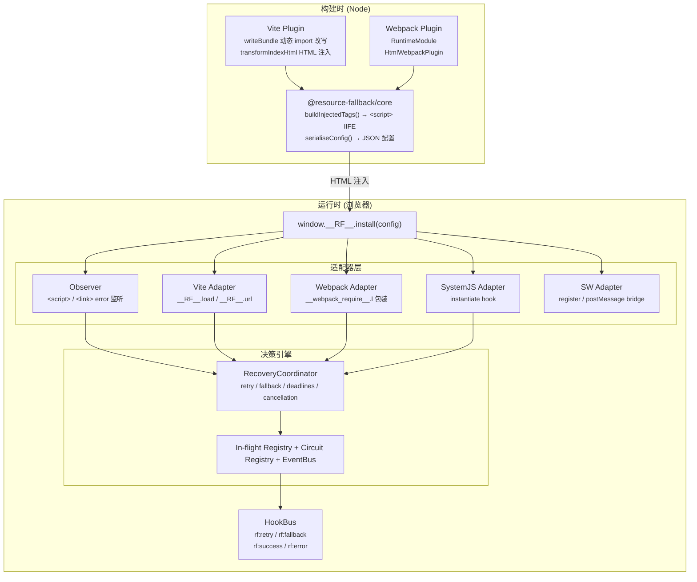
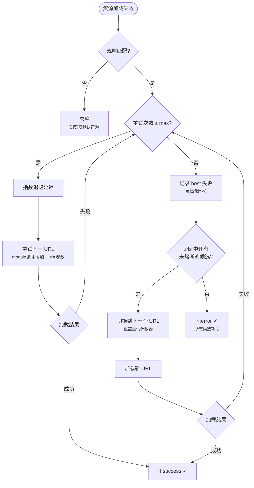

# 简介

## 什么是 resource-fallback

**resource-fallback** 是一个零心智负担的前端资源回退方案。它为 Webpack 与 Vite 构建产物（同步 / 异步 JS、CSS）提供运行时 **重试 → 多 CDN 回退 → 回源** 能力，业务代码无需任何改动。

项目包含三个 npm 包：

| 包                                  | 说明                                 |
| ----------------------------------- | ------------------------------------ |
| `@resource-fallback/core`           | 浏览器 IIFE 运行时 + Node 端工具函数 |
| `@resource-fallback/vite-plugin`    | Vite 4+ 插件                         |
| `@resource-fallback/webpack-plugin` | Webpack 5+ 插件                      |

## 为什么需要资源回退

前端静态资源通常托管在 CDN 上。当主 CDN 出现 DNS 故障、网络抖动或区域性不可用时，页面可能出现白屏、样式丢失或懒加载模块失败。

传统做法需要在业务代码中手动处理加载失败，或在网关层做复杂路由。resource-fallback 在**构建时注入运行时、运行时自动拦截失败**，按配置依次重试同一 URL、切换到备用 CDN、最终回源，整个过程对业务透明。

::: tip 适用场景

- 多 CDN 容灾与主备切换
- 静态资源加载失败时的自动降级
- 需要监控上报的资源 fallback 链路
  :::

## 核心架构总览

```mermaid
graph TB
  subgraph build["构建时 (Node)"]
    VP["Vite Plugin<br/><small>writeBundle 动态 import 改写<br/>transformIndexHtml HTML 注入</small>"]
    WP["Webpack Plugin<br/><small>RuntimeModule<br/>HtmlWebpackPlugin</small>"]
    CORE["@resource-fallback/core<br/><small>buildInjectedTags() → &lt;script&gt; IIFE<br/>serialiseConfig() → JSON 配置</small>"]
    VP --> CORE
    WP --> CORE
  end

  CORE -->|"HTML 注入"| INSTALL

  subgraph runtime["运行时 (浏览器)"]
    INSTALL["window.__RF__.install(config)"]

    subgraph adapters["适配器层"]
      OBS["Observer<br/><small>&lt;script&gt; / &lt;link&gt; error 监听</small>"]
      VA["Vite Adapter<br/><small>__RF__.load / __RF__.url</small>"]
      WA["Webpack Adapter<br/><small>__webpack_require__.l 包装</small>"]
      SA["SystemJS Adapter<br/><small>instantiate hook</small>"]
      SWA["SW Adapter<br/><small>register / postMessage bridge</small>"]
    end

    subgraph engine["决策引擎"]
      RC["RecoveryCoordinator<br/><small>retry / fallback / deadlines / cancellation</small>"]
      REG["In-flight Registry + Circuit Registry + EventBus"]
    end

    HB["HookBus<br/><small>rf:retry / rf:fallback<br/>rf:success / rf:error</small>"]

    INSTALL --> OBS
    INSTALL --> VA
    INSTALL --> WA
    INSTALL --> SA
    INSTALL --> SWA
    OBS --> RC
    VA --> RC
    WA --> RC
    SA --> RC
    RC --> REG
    REG --> HB
  end
```

### 回退流程

```mermaid
flowchart TD
  START(["资源加载失败"]) --> MATCH{"规则匹配?"}
  MATCH -->|否| IGNORE["忽略<br/><small>浏览器默认行为</small>"]
  MATCH -->|是| RETRY{"重试次数 ≤ max?"}
  RETRY -->|是| DELAY["指数退避延迟"] --> RELOAD["重试同一 URL<br/><small>module 脚本附加 __rf= 参数</small>"]
  RELOAD --> RESULT{"加载结果"}
  RESULT -->|成功| SUCCESS["rf:success ✓"]
  RESULT -->|失败| RETRY
  RETRY -->|否| RECORD["记录 host 失败<br/>到熔断器"] --> NEXT{"urls 中还有<br/>未熔断的候选?"}
  NEXT -->|是| SWITCH["切换到下一个 URL<br/><small>重置重试计数器</small>"] --> RELOAD2["加载新 URL"]
  RELOAD2 --> RESULT2{"加载结果"}
  RESULT2 -->|成功| SUCCESS
  RESULT2 -->|失败| RETRY
  NEXT -->|否| GIVEUP["rf:error ✗<br/><small>所有候选耗尽</small>"]
```

## 包结构

| 包                                                                                                     | 说明                                 | 版本信息                   |
| ------------------------------------------------------------------------------------------------------ | ------------------------------------ | -------------------------- |
| [`@resource-fallback/core`](https://www.npmjs.com/package/@resource-fallback/core)                     | 浏览器 IIFE 运行时 + Node 端工具函数 | 见 npm 页面 / package.json |
| [`@resource-fallback/vite-plugin`](https://www.npmjs.com/package/@resource-fallback/vite-plugin)       | Vite 4+ 插件                         | 见 npm 页面 / package.json |
| [`@resource-fallback/webpack-plugin`](https://www.npmjs.com/package/@resource-fallback/webpack-plugin) | Webpack 5+ 插件                      | 见 npm 页面 / package.json |

### @resource-fallback/core

核心运行时与构建工具：

- **RecoveryCoordinator** — 页面侧恢复决策引擎，统一负责规则选择、retry / fallback、deadline、取消与事件
- **Retry** — 指数退避 + 抖动
- **Circuit Registry** — per-host 熔断状态；页面侧当前只有一个 registry，支持 localStorage 跨 Tab 共享
- **Observer** — 监听 `<script>` / `<link>` 的 error 事件
- **Adapter** — Vite / Webpack / SystemJS / SW 适配器，负责 transport 与 ownership 接入
- **buildInjectedTags()** — 生成注入 HTML 的标签
- **getRuntimeCode()** — 获取 IIFE 运行时源码

### @resource-fallback/vite-plugin

Vite 构建集成，详见 [Vite 集成](./vite.md)：

- `transformIndexHtml` HTML 注入
- 动态 `import()` 包装
- 可选 Hybrid SW 资产生成

当前页面 runtime 还有三个需要明确的限制：

- `window.__RF__.url(filename)` 只会使用第一条已编译规则的 `base` 构造首轮 URL，不会跳过已熔断 host；
- 规则会先按 `base` 长度降序编译；恢复开始后，RecoveryCoordinator 会根据初始 URL 选中一条规则，并沿该规则的有序候选继续恢复；
- 页面侧目前只初始化一个 circuit registry，而不是每条规则各自一个。

### @resource-fallback/webpack-plugin

Webpack 构建集成，详见 [Webpack 集成](./webpack.md)：

- `RuntimeModule` 注入，patch `__webpack_require__.l`
- `html-webpack-plugin` 集成 HTML 注入
- 可选 Hybrid SW 资产生成

## 下一步

- [快速开始](./quick-start.md) — 安装与最小配置
- [配置参考](./configuration.md) — 完整选项说明
- [Hybrid Service Worker](./service-worker.md) — 图片、字体等子资源回退
