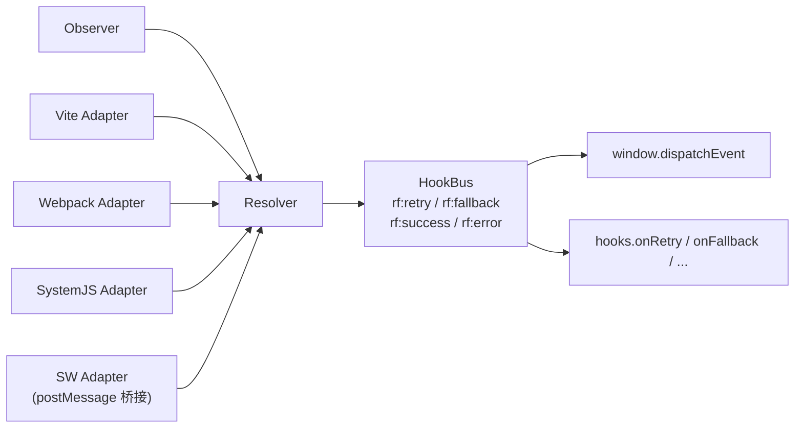

# 运行时事件

resource-fallback 通过 DOM CustomEvent 和 JS 函数钩子暴露运行时状态，便于对接监控上报与降级 UI。

## 事件列表

| 事件名        | 触发时机                              | detail                  |
| ------------- | ------------------------------------- | ----------------------- |
| `rf:retry`    | 同一 URL 重试                         | `{ url, attempt }`      |
| `rf:fallback` | 切换到下一个候选 URL                  | `{ from, to, reason? }` |
| `rf:success`  | 资源加载成功（经过至少一次重试/回退） | `{ url, attempts }`     |
| `rf:error`    | 所有候选 URL 耗尽                     | `{ url, reason? }`      |

::: info 事件来源
页面侧 adapter（Observer、Vite、Webpack、SystemJS）直接派发 DOM CustomEvent。Hybrid SW 模式下，SW 通过 `postMessage` 将事件送回页面，再由页面 runtime 转发为相同的 `rf:*` 事件。
:::

## 监听示例

### 基础监听

```ts
window.addEventListener('rf:retry', (e) => {
  console.log('重试:', e.detail);
  // { url: 'https://cdn1.example.com/assets/app.js', attempt: 1 }
});

window.addEventListener('rf:fallback', (e) => {
  console.log('回退:', e.detail);
  // { from: 'https://cdn1.example.com/assets/app.js', to: 'https://cdn2.example.com/assets/app.js' }
});

window.addEventListener('rf:success', (e) => {
  console.log('成功:', e.detail);
  // { url: 'https://cdn2.example.com/assets/app.js', attempts: 2 }
});

window.addEventListener('rf:error', (e) => {
  console.log('失败:', e.detail);
  // { url: 'https://cdn1.example.com/assets/app.js', reason?: unknown }
});
```

### 入口失败降级 UI

入口 bundle 如果所有 fallback 都失败，React/Vue 不会初始化。建议在 `index.html` 中添加内联监听：

```html
<script>
  window.addEventListener('rf:error', function () {
    document.body.innerHTML = '<p>资源加载失败，请刷新页面</p>';
  });
</script>
```

## 与监控系统对接

推荐通过 DOM 事件对接监控系统：

```ts
window.addEventListener('rf:retry', (e) => {
  monitor.send('resource.retry', e.detail);
});

window.addEventListener('rf:fallback', (e) => {
  monitor.send('resource.fallback', e.detail);
});

window.addEventListener('rf:error', (e) => {
  monitor.send('resource.error', e.detail);
});
```

### JS 函数钩子

或通过 `hooks` 配置（需要 `externalRuntime: true`，因为函数无法 JSON 序列化到内联 script）：

```ts
// externalRuntime 模式下，通过 install() 传入 hooks
window.__RF__.install({
  rules: [...],
  hooks: {
    onRetry:    (e) => analytics.send('rf.retry', e),
    onFallback: (e) => analytics.send('rf.fallback', e),
    onSuccess:  (e) => analytics.send('rf.success', e),
    onError:    (e) => sentry.captureMessage('rf.error', e),
  },
});
```

::: warning hooks 限制
内联运行时模式下，`hooks` 无法通过构建配置传入（函数不能 JSON 序列化）。如需使用 hooks，请启用 `externalRuntime: true` 并自行部署 runtime 文件。
:::

## HookBus 与 adapter 关系



## 调试

生产环境保持 `debug: 'auto'`，线上排查时设置：

```js
localStorage.__RF_DEBUG__ = '1';
```

刷新页面后即可在控制台看到详细日志。

## 相关文档

- [快速开始 — 验证](./quick-start.md#验证)
- [最佳实践 — 线上监控](./best-practices.md#线上监控)
- [CSP 与 SRI — externalRuntime](./csp-sri.md)
