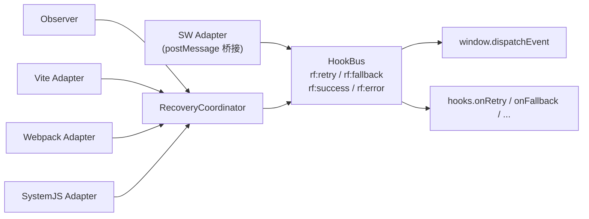

# 运行时事件

resource-fallback 通过 DOM CustomEvent 和可选 JS 函数钩子暴露运行时状态，便于对接监控上报与降级 UI。自动注入场景下推荐优先监听 DOM 事件，因为构建配置中的函数会在序列化时被丢弃。

## 事件列表

| 事件名        | 触发时机                            | detail                  |
| ------------- | ----------------------------------- | ----------------------- |
| `rf:retry`    | 同一 URL 重试                       | `{ url, attempt }`      |
| `rf:fallback` | 切换到下一个候选 URL                | `{ from, to, reason? }` |
| `rf:success`  | 页面侧一次已恢复 session 成功结束   | `{ url, attempts }`     |
| `rf:error`    | 页面侧 session 失败，或 SW 透传错误 | `{ url, reason? }`      |

::: info 事件来源
页面侧 adapter（Observer、Vite、Webpack、SystemJS）会先把失败交给 RecoveryCoordinator，再由 HookBus 派发 DOM CustomEvent。Hybrid SW 模式下，SW 通过 `postMessage` 将事件送回页面，再由页面 runtime 转发为相同的 `rf:*` 事件。

- 页面侧 Coordinator 事件里的 `reason` 是 transport / coordinator 产生的 opaque failure value，类型为 `unknown`
- SW 透传到页面的 `reason` 可能包含 resolver giveup 原因，例如 `'rules-exhausted'` 或 `'no-match'`
- 页面侧 `rf:success` 只在一次恢复 session 成功后触发；首轮直接成功不会补发 page success 事件
- SW `rf:success` 表示一次可用的 SW 响应，包含首轮 fetch 直接成功与 fallback 后成功
  :::

## 监听示例

### 基础监听

```ts
window.addEventListener('rf:retry', (e) => {
  console.log('重试:', e.detail);
  // { url: 'https://cdn1.example.com/assets/app.js', attempt: 1 }
});

window.addEventListener('rf:fallback', (e) => {
  console.log('回退:', e.detail);
  // { from: 'https://cdn1.example.com/assets/app.js', to: 'https://cdn2.example.com/assets/app.js' }
});

window.addEventListener('rf:success', (e) => {
  console.log('成功:', e.detail);
  // { url: 'https://cdn2.example.com/assets/app.js', attempts: 2 }
});

window.addEventListener('rf:error', (e) => {
  console.log('失败:', e.detail);
  // 页面侧 reason 是 unknown；SW 透传时也可能是 'rules-exhausted' / 'no-match'
});
```

### 入口失败降级 UI

`rf:error` 不只可能来自入口 bundle；它也可能发生在页面已启动后的其他资源，或来自 SW 透传。因此不要对每个 `rf:error` 都直接替换整个页面。若你只想处理入口失败，请按**已知入口资源 URL**过滤，并在应用成功启动后移除这个监听：

```html
<p id="rf-entry-fallback" hidden>资源加载失败，请刷新页面</p>
<script>
  (function () {
    var expectedEntry = 'https://cdn.example.com/assets/main.js';

    function onRfError(event) {
      var detail = event.detail || {};
      if (detail.url !== expectedEntry) return;

      var fallback = document.getElementById('rf-entry-fallback');
      if (fallback) fallback.hidden = false;
    }

    window.addEventListener('rf:error', onRfError);

    // 应用成功启动后请在入口代码里执行：
    // window.removeEventListener('rf:error', onRfError);
  })();
</script>
```

这个入口兜底建议保持**通用终态 UI**：页面侧 `rf:error.detail.reason` 不应被当成稳定 reason 枚举；如果你只想判断“是否真的进入过回退链”，请改看 `rf:retry` / `rf:fallback`。

## 与监控系统对接

推荐通过 DOM 事件对接监控系统：

```ts
window.addEventListener('rf:retry', (e) => {
  monitor.send('resource.retry', e.detail);
});

window.addEventListener('rf:fallback', (e) => {
  monitor.send('resource.fallback', e.detail);
});

window.addEventListener('rf:error', (e) => {
  monitor.send('resource.error', e.detail);
});
```

### 判断是否真的进入回退链

测试或监控时，若要区分“终态失败”与“确实发生过 retry / fallback”，推荐单独记录 `rf:retry` / `rf:fallback`：

```ts
const events: Array<{ type: string; detail: unknown }> = [];

['rf:retry', 'rf:fallback', 'rf:success', 'rf:error'].forEach((type) => {
  window.addEventListener(type, (e) => {
    events.push({ type, detail: (e as CustomEvent).detail });
  });
});

function didFallbackRun(since: number) {
  return events.slice(since).some((e) => e.type === 'rf:retry' || e.type === 'rf:fallback');
}
```

### 监控指标建议

| 指标       | 推荐来源                                                  |
| ---------- | --------------------------------------------------------- |
| 重试率     | `rf:retry` 按 host 计数                                   |
| 回退率     | `rf:fallback` 的 `from` → `to`                            |
| 终态失败率 | `rf:error` 总量                                           |
| SW 耗尽率  | **仅在 SW 透传语境下**统计 `reason === 'rules-exhausted'` |
| 熔断命中   | 结合 debug 日志或 circuit state 观测被跳过的 host         |

### JS 函数钩子

如需函数钩子，请在页面里手动调用 `window.__RF__.install()`；只有直接传入函数对象时这些钩子才会保留：

```ts
window.__RF__.install({
  rules: [...],
  hooks: {
    onRetry:    (e) => analytics.send('rf.retry', e),
    onFallback: (e) => analytics.send('rf.fallback', e),
    onSuccess:  (e) => analytics.send('rf.success', e),
    onError:    (e) => sentry.captureMessage('rf.error', e),
  },
});
```

::: warning hooks 限制
`buildInjectedTags()` 与插件自动生成的 `install(...)` 调用都会先序列化配置对象，因此构建配置里的函数钩子总会被丢弃。`externalRuntime` 只改变 script 放置方式，不会保留这些函数。自动注入场景请使用 DOM `rf:*` 事件；如需 hooks，请在页面代码里手动调用 `window.__RF__.install()`。
:::

## HookBus 与 adapter 关系


```mermaid
flowchart LR
  OBS["Observer"] --> RC["RecoveryCoordinator"]
  VA["Vite Adapter"] --> RC
  WA["Webpack Adapter"] --> RC
  SA["SystemJS Adapter"] --> RC
  SWA["SW Adapter<br/>(postMessage 桥接)"] --> HB["HookBus<br/>rf:retry / rf:fallback<br/>rf:success / rf:error"]
  RC --> HB
  HB --> DOM["window.dispatchEvent"]
  HB --> HOOKS["hooks.onRetry / onFallback / ..."]
```

## Hybrid SW 事件桥

SW 事件会优先投递给触发该 fetch 的页面客户端（`FetchEvent.clientId`）；只有极少数没有 `clientId` 的场景才会回退为窗口广播。讨论 `rules-exhausted` / `no-match` 这类 reason 时，也应明确它们属于 **SW resolver 透传语境**，而不是页面侧稳定 API。

## 调试

生产环境保持 `debug: 'auto'`，线上排查时设置：

```js
localStorage.__RF_DEBUG__ = '1';
```

刷新页面后即可在控制台看到详细日志。

## 相关文档

- [快速开始 — 验证](./quick-start.md#验证)
- [最佳实践 — 线上监控](./best-practices.md#线上监控)
- [CSP 与 SRI — externalRuntime](./csp-sri.md)
